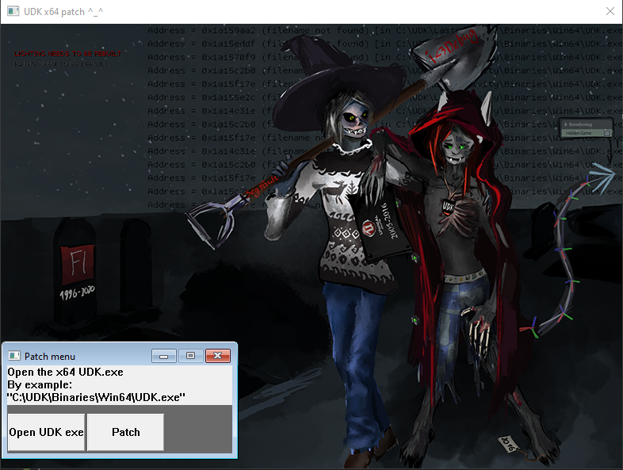

# UDK-x64-patch DLLBind Fix by Remor
UDK / Unreal Engine 3 x64 fix for broken DLLBind: strings and out parameters not working or crashing. Resolves issues with incorrect pointer passing in 64-bit builds, so external DLL calls behave correctly. Useful if your DLL functions return garbage or fail.

## The Problem

In 64-bit UDK builds, calls to external DLLs may behave incorrectly:
- Strings are not passed correctly
- `out` parameters return garbage
- Functions may crash or return invalid data

This happens because pointers are treated as 32-bit instead of 64-bit.

```diff
What the hell did you do, Epic Games?
This bug has persisted all the way from Unreal Engine 3 (07-22-2013)
right up until the engine's very demise!!!11

4 days with WinDBG and IDA — damn it!
```

## Program overview



## Why This Happens

UDK was shipped with a broken `libffi` configuration for x64.  
Because of a missing preprocessor definition (`X86_64`), pointer type metadata (`ffi_type_pointer`) is initialized with incorrect size values (4 bytes instead of 8).

As a result, any DLL interaction that relies on pointers is broken.

## What This Patch Does

This patch fixes the issue directly inside compiled `UDK.exe`.

It:
- Scans the `.data` section of the executable
- Locates the incorrect `ffi_type_pointer` structure
- Replaces it with correct x64 values (8-byte pointers)

```cpp
typedef struct _ffi_type
{
  size_t size;
  unsigned short alignment;
  unsigned short type;
  struct _ffi_type **elements;
} ffi_type;
```

`00000000'00000004 00000000'000e0004` -> `00000000'00000008 00000000'000e0008`

## Result

After patching:

DLLBind works correctly in x64
* Strings are passed properly
* out parameters return valid data
* External DLL calls behave as expected

## Usage
1. Run the patcher
2. Select your UDK.exe (Win64 version)
3. Click Patch

## Notes
Only works with 64-bit UDK
Safe to run multiple times (already patched check included)
